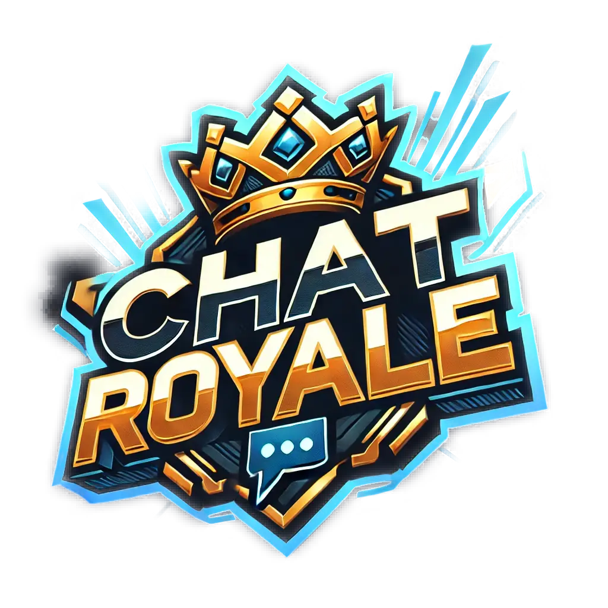

Chat Royale is a battle royale concept game that takes place in chat rooms. Battle against 99 other players using commands in chat, avoid being deleted in the channels by The Virus, and be the last one standing to claim your title as MemeLord!

Link to the project: [Chat Royale](https://chatroyale.io)

## Concept

This idea came to me after hearing about the app [Clubhouse](https://techcrunch.com/2020/04/18/clubhouse-app-chat-rooms/), which is a voice chat social media app. Users can create rooms, where they can invite other users to talk and hang out in, and users can leave rooms and join those rooms as they want, finding more popular rooms to hang out and talk in.

One of the interesting points I liked about the Clubhouse app, was the idea that a room could sort of 'pop up' and become really popular. Users could flock to this room, and then another room might take over and people would leave to that. The idea that a room had to captivate a live audience, or die, was the inspiration for Chat Royale.

That moving chat room mechanic seemed fun and exciting, so I started thinking about how that kind of mechanic might work in a game. How could I motivate players to create channels, and join other ones, all while chatting and still have it be some sort of "game"? When I tried to actually gamify this concept, it quickly became apparent that some other element(s) would need to be added to incentivize players, and that's where the battle royale concept came in. Rather than have users create the channels and invite users, the battle royale will force players to start in many different channels, and eventually all be forced into one. Of course, now I have to figure out the other parts of a battle royale, like fighting, safe zones, and loot!

## The Game

Writing the core gameplay was a lot of fun and the ideas just kept flowing naturally while working. The game is heavily inspired by Fortnite, with some Modern Warfare Warzone touches. The style of chat and commands are inspired by my early days of IRC glory. The project consists of a NodeJS game server, and a React web client built using Vite/Tailwind, both of which use [SocketIO](https://socket.io/) for the game communication. The code will be going up soon, I just want people to have some time to play the game and figure things out for themselves, before the code can be dissected.

The game server, core gameplay loop, and matchmaking were quite the learning experience for me during development, as this project ended up basically being a very basic and rudimentary "game engine". One thing I struggled with a little at first was the random loot generation across an entire "map". [This paper](https://www.slideshare.net/RejoshSamuel/item-generation-using-rule-based-randomization-algorithms-in-rpg-games-rejosh-samuel) helped me get a better understanding of some of the different loot drop methodologies used in games. I ended up using a rule-based random algorithm, which seemed like a good choice for this.

## Soundtrack

Choons

- [Aesop Rock - None Shall Pass](https://www.youtube.com/watch?v=KNrB6--KBqs)
- [Joywave ft. KOPPS - Tongues](https://www.youtube.com/watch?v=AqmwKi6KOSw)
- [Thievery Corporation - Saudade](https://www.youtube.com/watch?v=oznQNIvnaAQ)
- [Kendrick Lamar - Squabble Up](https://www.youtube.com/watch?v=fuV4yQWdn_4)
- [James Grant pres. Movement Vol. 3](https://www.youtube.com/watch?v=B2w4thab6N0)
