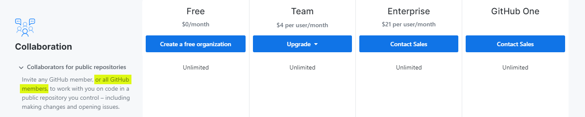

What the hell am I talking about?

This is a weird website idea I came up with recently, and it was relatively easy to code and implement, so, here we are. I'll keep this blog post brief, because there's not much to it, and I have some other cool (imo) projects I'll be talking about soon, hopefully.

# [giddyup.horse](https://giddyup.horse)

giddyup.horse is an open source website that is editable by anyone. The website is hosted using GitHub Pages, so all the source code is available to look at and modify, but the key difference is that literally anybody on GitHub can become a contributor to the repo, in seconds, automatically. This means anybody can modify the `master` branch, create branches, and create and manage pull requests on this repo. There's no need to fork and make changes in your own repo, then pull request back in. You can literally create branches right in this repo, and merge them yourself into `master`, or even commit directly to `master`, like a true psychopath. If you have time for a couple commits, you have time to deploy changes to giddyup.horse.

I came up with this idea when I started thinking about creating an open source website, that was created by the people for the people. This sort of thing already exists in open source repos, but, as far as I know, only as described before, where the availability of the code is there, and managed by a group. The idea of literally *anyone* being able to completely modify a repo/website, *live*, is not something I think I've seen before (I'm probably wrong, would love to know some examples though).

The actual functionality is pretty simple. GitHub has an [API](https://developer.github.com/v3/), which lets you manage repos and do a lot of cool stuff. One of the endpoints, documented [here](https://developer.github.com/v3/repos/collaborators/#add-a-repository-collaborator), allows for sending invites to add collaborators to a repository you have the proper permissions in. I created an AWS Lambda which uses [axios](https://www.npmjs.com/package/axios) to call out to that GitHub API endpoint using the username supplied in the body of the Lambda request. The only thing left to do was create another simple GitHub Pages site to allow users to invite themselves as contributors using the Lambda endpoint, so I created [Saddle](https://git-tee-up.github.io/saddle/).

The websites/repos are on a secondary GitHub account, for obvious reasons. There's a good chance the internet could completely destroy giddyup.horse in a manner not compliant with ToS, and I'd prefer to not have my personal account go down in flames. Although, I would like to point out, after I came up with this whackjob idea, I checked the [GitHub Pricing](https://github.com/pricing) page to see the limits on free tier accounts, and other details, and I saw this:

It does say literally ***all GitHub members***, so hey, let's see if they honor that statement.

The name of the site was inspired by me trying to come up with some clever play on words using `git`, then remembering there was a `.horse` TLD, doing a search for `giddyup.horse`, and seeing it wasn't taken yet, which made me inexplicably happy.

## That's It

Not much else to say, I said I was keeping this post short. I'll share a few tracks I've been listening to though.

- [X Ambassadors - Boom](https://www.youtube.com/watch?v=mXLRy1cNMWs)
- [Harry Nilsson - Spaceman](https://www.youtube.com/watch?v=fND5WUxwi_Y) (yeah, Space Force...)
- [The Toxic Avenger - Make This Right](https://www.youtube.com/watch?v=1CGMk_roNaE)
- [The Drums - Heart Basel](https://www.youtube.com/watch?v=BUEn0QKJS20)
- [Peggy Lee - Why Don't You Do Right](https://www.youtube.com/watch?v=4uTcw_A80Bo) (bonus: [Gramophonedzie - Why Don't You](https://www.youtube.com/watch?v=uT8OEtf5r1U))
