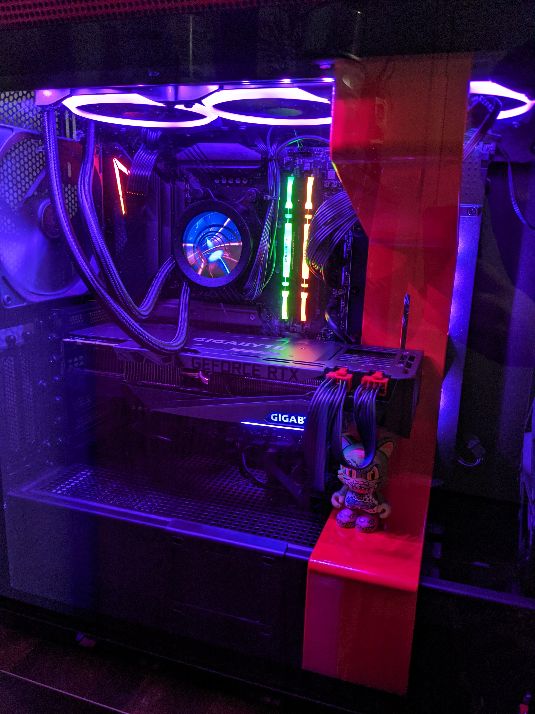
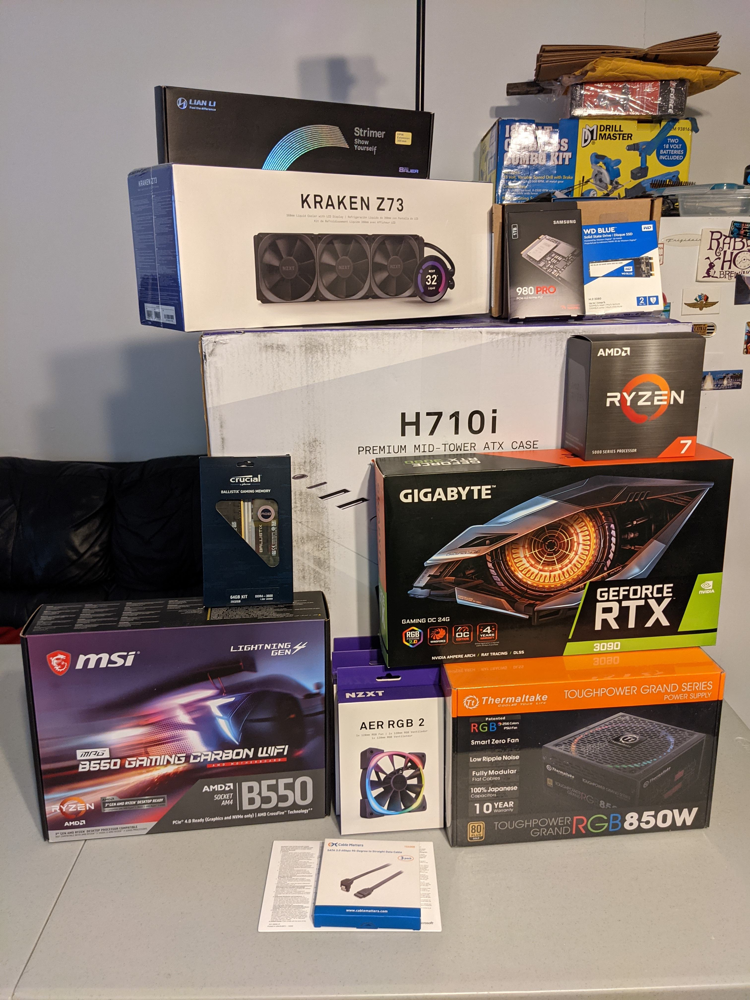
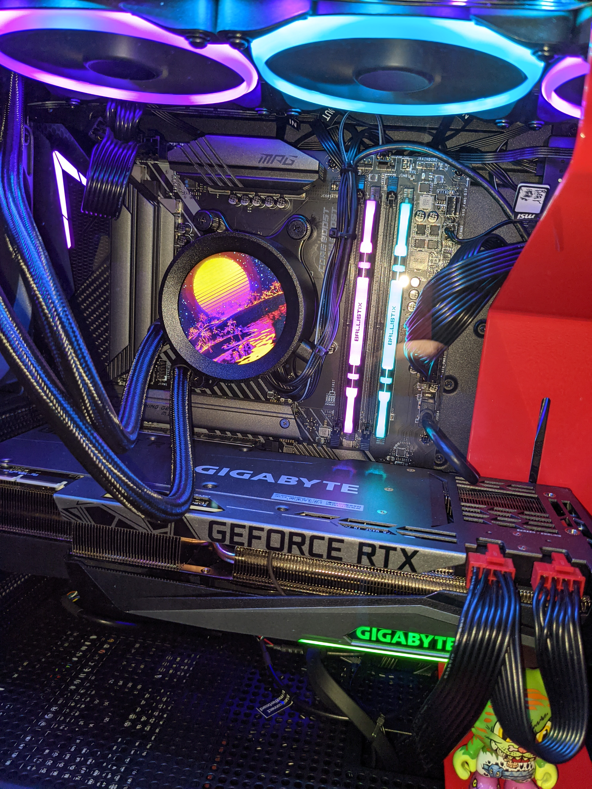

  New PC build: Ryzen 7 5800X, RTX 3090, 64GB DDR4 3600 RAM

After dozens of order attempts and two reversed orders, I managed to obtain all the new electronics that I wanted that were dropping at the end of the year for 2020! I had to fight against millions of consumers, scalpers, and bots, and at the end of it all, I sit with the spoils of my victory: a brand new PC with a Ryzen 7 5800X and an RTX 3090, and a new PS5 console.

The full specs and parts list of the new PC are listed below:

- Ryzen 7 5800X CPU
- NZXT Kraken Z73 AIO CPU Cooler
- Gigabyte GeForce RTX 3090 TURBO 24GB GPU
- 64GB Crucial Ballistix DDR4-3600 RAM (2x32GB)
- MSI MPG B550 Gaming Carbon Wifi Motherboard
- Samsung 980 Pro 1TB M.2-2280 NVMe SSD PCIe 4.0 (Boot drive/important files/games)
- Samsung 970 EVO Plus 2TB M.2-2280 NVMe SSD PCIe 3.0 (games/misc)
- Western Digital Black 6TB 7200RPM SATA HDD (movies/music/projects)
- NZXT H710i ATX Mid Tower Case
- Thermaltake Toughpower RGB 850W 80+ Gold Modular PSU

  (<a href="https://pcpartpicker.com/list/gPBvdD">https://pcpartpicker.com/list/gPBvdD</a>)

  The parts. WD Blue was replaced with the Samsung 970 Plus.

I was overdue for a new PC. I had my previous computer for over 4 years, and it was starting to experience some random crashes and slower boot times, despite having an SSD. The previous PC had an I7 4790, MSI GTX 1070, 16GB DDR3 RAM, 1TB SATA SSD, and 3TB HDD. This new machine has been quite an upgrade, to say the least, and hopefully this one will last me another 4+ years of solid work and entertainment.

## Assembly

Putting this PC together was actually one of the most stressful things I've had to do recently. Although I've done extensive work on, and rebuilt, many of my computers, this is the first PC that I built 100% from scratch, with my previous machines being frankenstein pre-builts or laptops. Dealing with such expensive equipment had me a little on edge, even with a couple of my buddies helping me through most of it.

Getting all the parts installed was relatively easy, with the true pain and suffering beginning when it was time to wire the fans and get the all RGB lights working and in sync on the fans, LED strips in the case, RAM, and motherboard. The NZXT CAM software, in my personal experience, was by far the best software in terms of both UI/UX and functionality, blowing out the Gigabyte Fusion and MSI Dragon Center. I gave up on both of the latter programs, and the Crucial MOD software got the job done perfectly fine to get the RAM lighting setup. If you're looking for RGB support, you're probably gonna wanna do a lot of research and find the most compatible parts. I had great luck with the NZXT AIO CPU Cooler and the NZXT Case LED strips, but my NZXT case fans don't light up as they should, and my motherboard lights just run rainbow on their own (which is fine, because I hated the MSI Dragon Center software).

Some tips for your new build! Be sure to flash your BIOS to the latest version from the manufacturer's website. If you're doing any work with Hyper-V ([Android Studio emulators](https://androidstudio.googleblog.com/2019/10/android-emulator-hypervisor-driver-for.html), for instance) or any other CPU virtualization, you're gonna want to enable VMX for Intel chips or SVM for AMD chips in the BIOS. If you're using high performance RAM, you'll want to enable an [XMP Profile](https://www.pcgamer.com/what-are-xmp-profiles-and-how-do-i-use-them/) in your BIOS, so you can maximize the speed your RAM is running at. Don't assume because you're using high-end parts that it will default to an XMP Profile being turned on or it being automatically clocked to a higher frequency. Make sure you have full compatibility for both lighting/cooling between PWM/DC (4-pin/3-pin) fans if you're mixing them, I believe that's part of my issue that I mentioned above with RGB in the case fans using the NZXT CAM app.

I can't stress the importance of testing individual parts one at a time if you're seeing problems with booting or installing Windows. I ended up receiving the 970 2TB SSD and a TP-Link PCIe AX WiFi network adapter a couple days after I completed the main build. I installed both of them at the same time, mostly because the free PCIe slot I wanted to use covered the second M.2 slot. I booted up my once-working Windows machine and found a friendly BSOD with an error containing `System thread exception not handled` . At this point, I thought I somehow thrashed my Windows install, and surely a fresh install will fix it! Several installs and a live Linux/Windows repair later, I finally realize that it was just some old/bad drivers for the newly installed network card 🙃 (and I had no internal/external disk drive for the included driver disk).

I was having trouble wrapping my head around how the network card and/or M.2 b0rked my install, and the answer was: it didn't. Bad drivers were causing Windows to error on boot and all that needed to be done was to remove the faulty device. Lesson learned for probably the 1000th time, slow down and take things piece by piece! I plan to either install the new drivers for that network card later or use it in a future build, as the onboard wifi is working pretty well (I'm using the antenna from the TP-Link network card, so that may explain that).

  Current primary RGB lighting theme is vaporwave/outrun inspired

## Hypebeast PS5

Buying a PS5 in the height of the November/December 2020 shopping craze is possibly one of my greatest achievements and will certainly be going on my resume 😜. But seriously, gaming is bigger than ever and getting your hands on the new consoles or new CPU/GPUs is next to impossible right now. We've officially entered the world of hypebeast electronics; welcome to a new circle of hell!

As [gaming continues to grow in popularity](https://www.theverge.com/2020/12/8/22163728/youtube-viewers-100-billion-hours-gaming-videos-2020) and computers and electronics continue to dominate many personal and professional aspects of our lives, purchasing cutting edge hardware is now becoming a battle against all odds. Not only has demand increased from actual consumers, but this spike in demand also brings in the scalpers and resellers looking to make a quick buck. As online sales become more and more prevalent, consumers are now having to compete against literal bots and machines to place orders. Walmart blocked an astonishing [20 million bots](https://www.techradar.com/news/ps5-and-xbox-series-x-stock-update-walmart-cracks-down-on-bots-and-scalpers) in 30 minutes that were trying to order the new PS5!

If you're looking to buy the latest and greatest technology now-a-days, one of your best bets is finding some sort of automated online notifications. You can find accounts on Twitter to follow and turn on notifications for; one account I'm a personal fan of is [@Wario64](https://twitter.com/Wario64), although he tweets about a wide range of video game related deals and news. What seems to be even more popular and effective, though, are the various Discord channels that are popping up. Why Discord? Well, it's free, has a good API for bots to interact with, and gamers are super familiar with it, so, it's perfect! There's a Discord server that's gotten quite large in the past month that I used to purchase all the hard-to-find electronics this year, and it's called [Average Tech Reviews](https://www.youtube.com/c/AverageTechReviews). The YouTube channel should have a link to the Discord, but if not, feel free to send me a message and I'll get you an invite!

## Soundtrack

Some holiday music for ya ass, boo 😘.

- [Two Feet - Go Fuck Yourself](https://www.youtube.com/watch?v=pFoja4b0ZFo)
- [Lil Nas X - Holiday](https://www.youtube.com/watch?v=9vMLTcftlyI)
- [Throttle - Japan](https://www.youtube.com/watch?v=FPkzLide5wA)
- [FOALS - Syrups](https://www.youtube.com/watch?v=tmLA7XCAQ5U)
- [Chef - Rags](https://www.youtube.com/watch?v=XD3mh-Kc7_0)
- [Tkay Maidza - You Sad](https://www.youtube.com/watch?v=8WjKZbxlaFA)
- [Rainbow Kitten Surprise - When It Lands](https://www.youtube.com/watch?v=LKtalf9Fb6M)
- [Haarper - Paint](https://www.youtube.com/watch?v=WIU-UK4fzCU)
- [The Killers - Exitlude](https://www.youtube.com/watch?v=vNLHDJ-aEBk)
- [Mk.gee – I Know How You Get](https://www.youtube.com/watch?v=6LPJJfsIPhE)
- [Hoodie Allen - Surprise Party (ft. Blackbear)](https://www.youtube.com/watch?v=ax2omNHZaWw)
