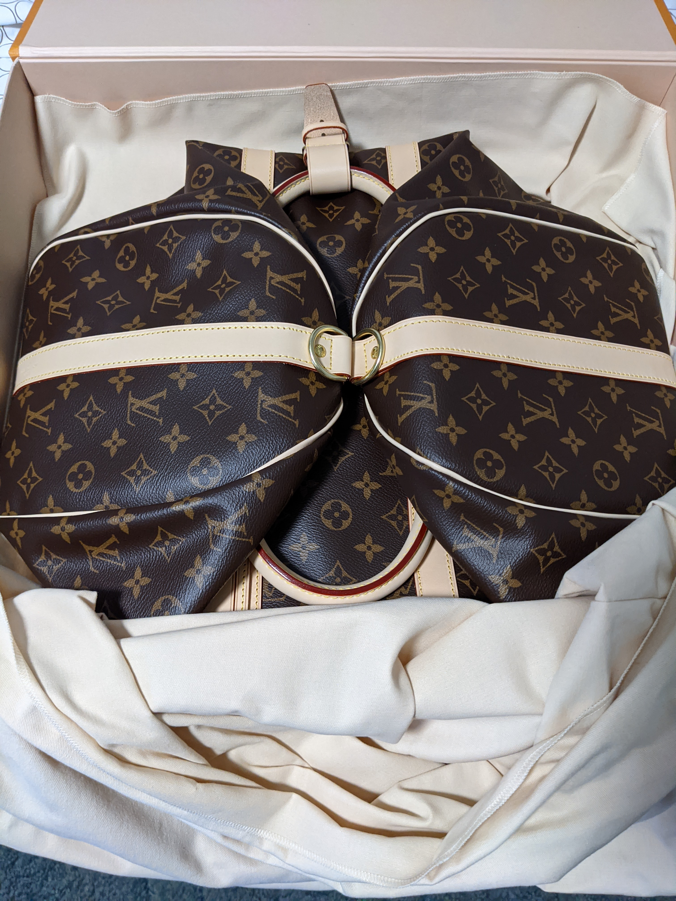
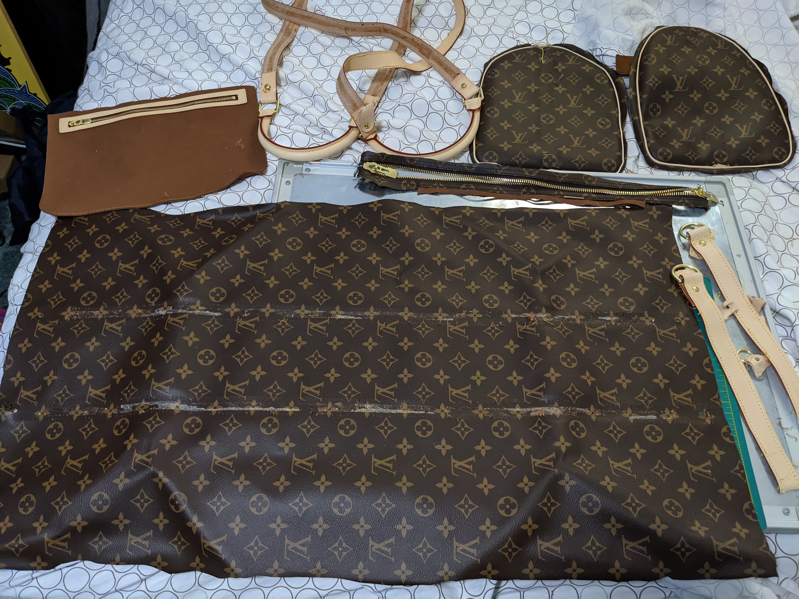
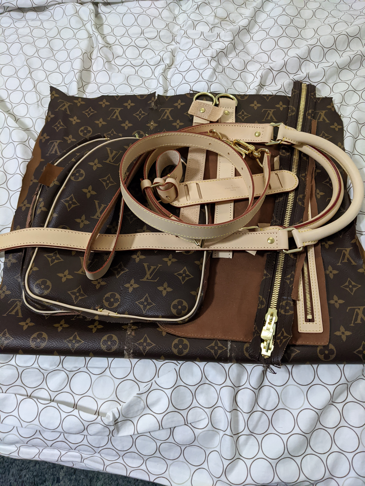
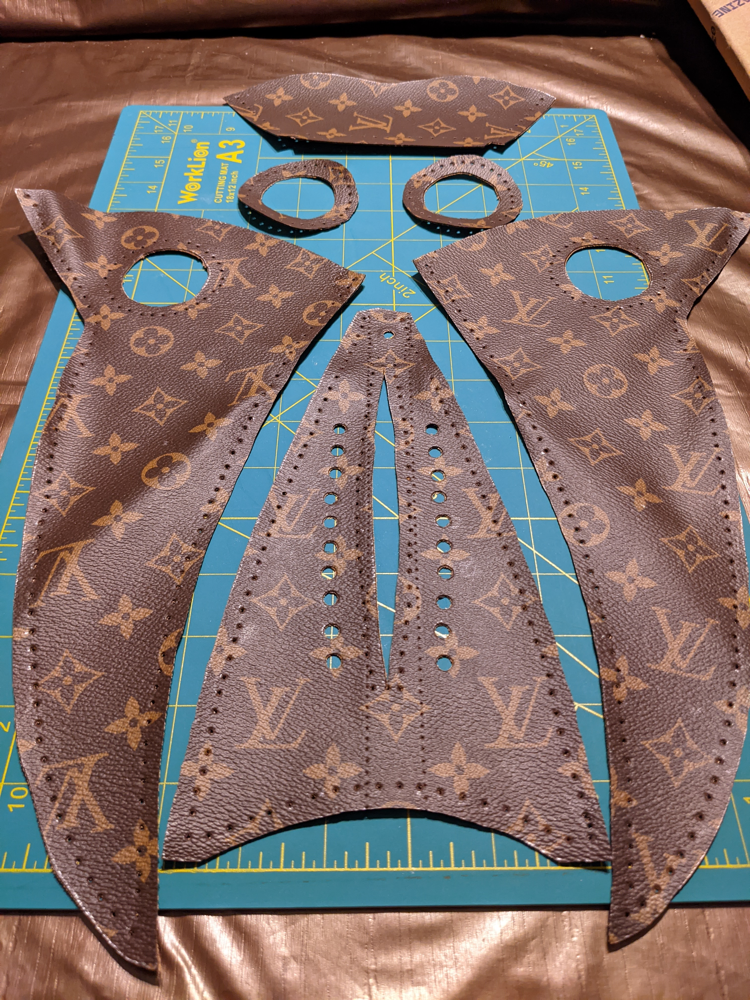

USAPlague was a project I made commenting on the United States' response to and handling of the COVID-19 pandemic. This piece is a leather plague doctor mask inspired by 17th century plague doctors. The mask was hand-crafted using parts taken from a genuine Louis Vuitton monogram bag that was cut apart. The project website was hosted at [usaplague.com](https://usaplague.com/) using Shopify and included an SMS signup/subscription flow using Twilio and a NextJS backend hosted on Vercel.

## Background

According to the [Johns Hopkins](https://coronavirus.jhu.edu/map.html) website and resource center, at the time the project was released, the USA had the highest number of cases and the greatest number of deaths from COVID-19, but did not have the most cases recovered from COVID-19. Despite having an astonishing 220k+ deaths from COVID-19 and Congress only releasing a single stimulus package, the US stock market continued to hit record breaking highs with many billionaires and corporations seeing the pandemic as another opportunity to increase their profits and maximize their wealth.

Influencers and celebrities have been throwing raging parties with 100s of people in their mansions and flaunting mask recommendations and regulations, while many regular people have begun working from home and have been quarantining safely for months. The amount of misinformation, ignorance, and lack of compassion that many Americans and influencers have responded to this pandemic with has been quite disappointing and has no doubt contributed needlessly to the number of deaths from this virus.

A quote from the project website:

> The "Chinese" Virus? Bullshit. This has been the USA Virus. A USA Plague, even, and it's a plague of misinformation, ignorance, politics, and rich privilege. A plague of fake news and mass manipulation, the USA Plague is highly contagious and threatens to destroy lives and the very fabric of our democratic society. The only cure for this plague is freedom of information, an open mind, and empathy towards others.

## Mask Off

Despite this project covering a very serious topic, I did have a lot of fun working on it and it took me out of my comfort zone many times. I had never worked with leather before, hadn't sewn in probably over a decade, got to work with a dremel for the first time, and nearly had a heart attack when I cut into the Louis Vuitton bag for the first time 🙃. I followed [this tutorial](https://www.youtube.com/watch?v=5okMxVhfUOw) on YouTube to create the plague mask, which also had the template for sale, and then I used [this forum tutorial](https://www.oakleyforum.com/threads/cutting-lenses-by-hand-a-guide.98248/) for help with cutting the sunglasses lenses to size.

First, I ordered leather/fabric working tools and supplies, including a precut piece of vegetable tanned leather for making a test mask. Making the test mask first proved to be a great decision because I had absolutely no clue wtf I was doing when I started this project and that became obvious very quick. The video tutorial on YouTube was really easy to follow, even for a beginner like myself, and with some blood, sweat, and cursing, the test mask was pretty much finished and I was starting to gain some confidence that I might be able to make this thing not look like total shit.

After making the initial prototype, it was time to order the Louis bag and start the show for real. This was a pretty big purchase, on top of the initial investment in tools and materials, and it was all starting to freak me out a little, but I took the plunge and bought the bag anyway. Once the purchase was made, there was really no turning back, so I ordered the remaining edge paint and sponges I needed as well and that's when it all kinda got real.

The bag arrived and, with this being my first LV purchase, I was blown away at the fantastic packaging, presentation, and overall quality of the product. It really did feel like a luxury, designer good, and I could easily see how indulging in these items could be intoxicating and even addicting (and for the price, it damn well *better* have felt amazing to open and use). I set the bag aside for a few days and contemplated just what in the actual fuck I was thinking, but eventually decided it was better to not think about it too hard, pulled out the Xacto knife, and started cutting. Before and after pics of the bag:

 

 

Once the bag was effectively destroyed, it was time to cut it into pieces so I could start making the plague mask. This was a thinner leather than the leather I used in the prototype, so it was easier to work with when cutting and punching holes, but ended up being a little trickier when it came time to edge and sew the leather together.

With all the leather cut, punched, and edged, I pulled out the dremel and cut up a pair of sunglasses to get the lenses ready. It was now time to sew it all up and bring this Louis Vuitton plague mask to life. Like I mentioned before, the thinner leather was a little difficult to work with when sewing, especially lining up the edges, but I think it turned out ok all things considered.

 

 

 

Plague Doctor Flex 😈😷:

## Takeaway

This was just a weird project I wanted to try and I had a great time working on it. It really pushed my boundaries and forced me to try a bunch of new things, which is always good and exciting. Leather is such a satisfying material to work with that I'm considering doing more leather work in the future just for fun. I'm obviously a newbie at sewing and leather work, but I think the mask looks pretty good all things considered and I'm very happy with it.

Now the question is: what do I do with a bunch of leftover Louis Vuitton monogram leather?

😈 Over Your Shoulder

## Soundtrack

Turn on, tune in, drop out or whatever

- [347aidan - DANCING IN MY ROOM](https://www.youtube.com/watch?v=HG_ZC9N_4NM)
- [Sad Night Dynamite - Killshot](https://www.youtube.com/watch?v=EwtTUYnfZkY)
- [Tai Verdes - Stuck In The Middle](https://www.youtube.com/watch?v=wUHl5YKq_Jc)
- [Charlie Burg - Lancaster Nights](https://www.youtube.com/watch?v=yqXpV8QO2ok)
- [Joji - Your Man](https://www.youtube.com/watch?v=RrtkU7i0qD8)
- [Hippie Sabotage - Options](https://www.youtube.com/watch?v=fAESZwbKMKI)
- [Ashes - Stellar](https://www.youtube.com/watch?v=wH3JmLBOnMU)
- [Logic - Dadbod](https://www.youtube.com/watch?v=9u5w44l16eI)
- [Portugal. The Man - Feel It Still](https://www.youtube.com/watch?v=pBkHHoOIIn8)
- [Yung Gravy - Gravy For Pope](https://www.youtube.com/watch?v=skwfetcwkR8)
- [Ehrling - Lounge](https://www.youtube.com/watch?v=a5ImNzexO4E)
